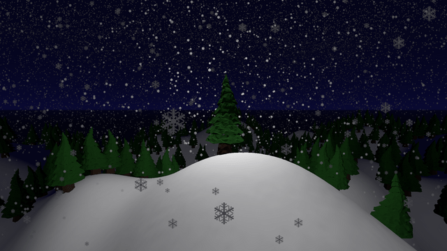

#  Giftfall

The New Year's demo.

I did not have a New Year tree, so I decided to program one for myself.

Originally, it was planned to add a garland and gameplay related to catching falling gifts (that is why the project has such a name), but there was not enough time.

## Features

- Snowy terrain
- Pine forest
- Snowfall
- Jingle Bells in the background
- Automatic camera rotation
- Quitting by pressing the <kbd>Esc</kbd> key
- Utilities:
  - utility for exporting the builds:
    - removes previous builds
    - parses the export configuration
    - creates the export directories
    - exports the builds
    - copies the licenses for every build
    - creates archives from the build files
  - utility for generating the logo for the Windows build

## License

The MIT License (MIT)

Copyright &copy; 2023 thewizardplusplus
