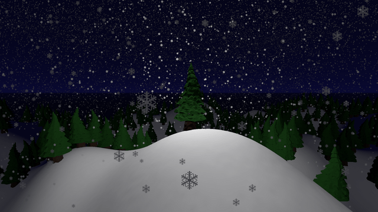

#  Giftfall

The New Year's demo.

I did not have a New Year tree, so I decided to program one for myself.

Originally, it was planned to add a garland and gameplay related to catching falling gifts (that is why the project has such a name and has mouse control), but there was not enough time.

## Features

- Snowy terrain
- Pine forest
- Snowfall
- Jingle Bells in the background
- Camera rotation:
  - by mouse movements
  - automatically after some time after the mouse movements

## License

The MIT License (MIT)

Copyright &copy; 2023 thewizardplusplus
